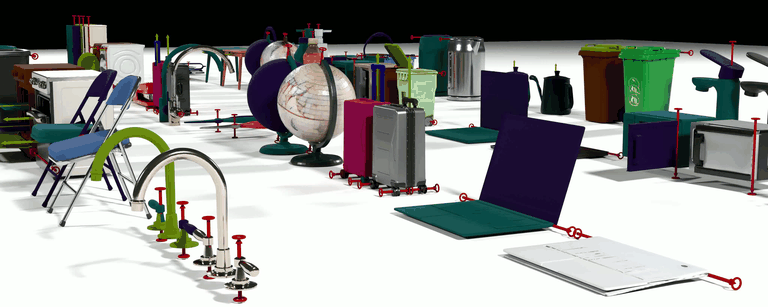
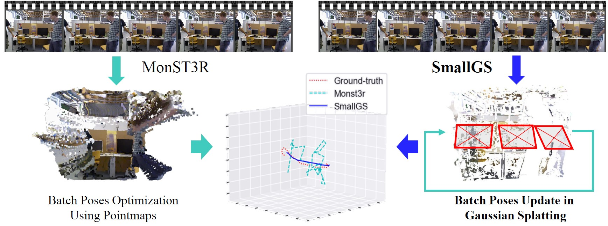
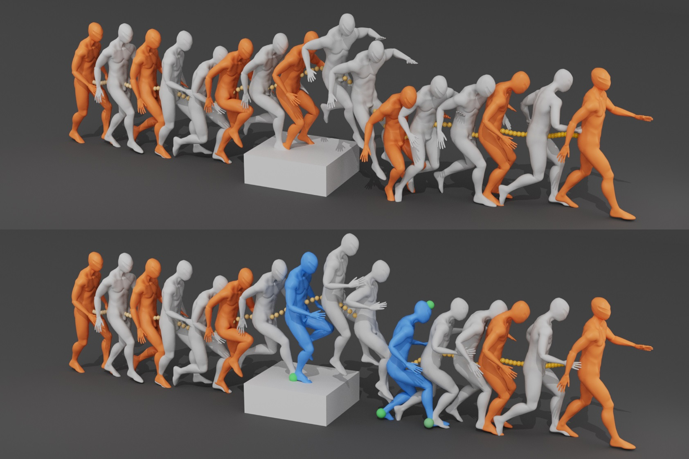
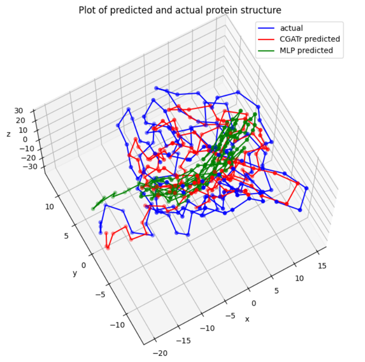
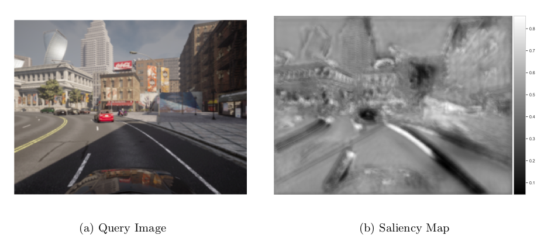
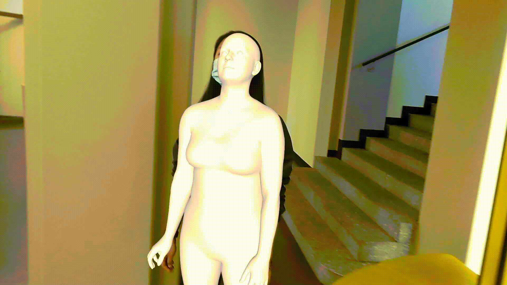

<!-- This is the front page of a website that is powered by the [academicpages template](https://github.com/academicpages/academicpages.github.io) and hosted on GitHub pages. [GitHub pages](https://pages.github.com) is a free service in which websites are built and hosted from code and data stored in a GitHub repository, automatically updating when a new commit is made to the respository. This template was forked from the [Minimal Mistakes Jekyll Theme](https://mmistakes.github.io/minimal-mistakes/) created by Michael Rose, and then extended to support the kinds of content that academics have: publications, talks, teaching, a portfolio, blog posts, and a dynamically-generated CV. You can fork [this repository](https://github.com/academicpages/academicpages.github.io) right now, modify the configuration and markdown files, add your own PDFs and other content, and have your own site for free, with no ads! An older version of this template powers my own personal website at [stuartgeiger.com](http://stuartgeiger.com), which uses [this Github repository](https://github.com/staeiou/staeiou.github.io). -->

Welcome to my website. I am Yuxin Yao, a 3rd Year PhD student in Information Engineering at University of Cambridge, supervised by Prof. Joan Lasenby. I am currently work with Elliott(Shangzhe) Wu. 
I obtained my Master of Engineering degree integrated with my bachelor at University College London. 

My current research focus on world modelling and dynamical 3D reconstruction for simulation, specifically involving prior from large foudation models into embodied AI agents. 

I am currently seeking for collaborations on project in these fields. Please contact me if you are interested!

## Project Experience

  
  

    <h3 class="title"><a href="https://arxiv.org/abs/2512.11798">Particulate: Feed-Forward 3D Object Articulation </a></h3>
    
 Ruining Li*, Yuxin Yao*, Chuanxia Zheng, Christian Rupprecht, Joan Lasenby, Shangzhe Wu, Andrea Vedaldi 

    
 CVPR 2026 In Proceeding

    
<a href="https://ruiningli.com/particulate">Project Page</a> / <a href="https://arxiv.org/abs/2512.11798">Paper</a> / <a href="https://github.com/RuiningLi/particulate">GitHub</a> / <a href="https://huggingface.co/spaces/rayli/particulate">HuggingFace</a>

    
<strong>TLDR:</strong> Particulate is a feed-forward approach that, given a single static 3D mesh of an everyday object, directly infers all attributes of the underlying articulated structure, including its 3D parts, kinematic structure, and motion constraints.

  

  
  

    <h3 class="title"><a href="https://arxiv.org/pdf/2504.17810">Gaussian Splatting based Camera Pose Estimation </a></h3>
    
 Yuxin Yao, Yan Zhang, Zhening Huang, Joan Lasenby 

    
 CVPR workshop 2025

    
<a href="https://yuxinyao620.github.io/SmallGS/">Project Page</a> / <a href="https://arxiv.org/pdf/2504.17810">Paper</a> / <a href="https://github.com/YuxinYao620/SmallGS-release">GitHub</a>

    
<strong>TLDR:</strong> SmallGS processes a dynamic video with small baseline to obtain the camera poses. It leverages Gaussian splatting to optimize camera poses while mitigating dynamic object interference via predicted semantic masks. It does not rely on 3D alignments or triangulation, alleviating the instability in camera pose estimation caused by limited parallax and weak geometric constraints.

  

  
  

    <h3 class="title"><a href="https://dl.acm.org/doi/10.1145/3721238.3730664">AutoKeyframe: Autoregressive Keyframe Generation for Human Motion Synthesis and Editing </a></h3>
    
 Bowen Zheng, Ke Chen, Yuxin Yao, Zijiao Zeng, Xinwei Jiang, He Wang, Joan Lasenby, Xiaogang Jin 

    
 ACM SIGGRAPH 2025

    
 <a href="https://dl.acm.org/doi/10.1145/3721238.3730664">Paper</a> / <a href="https://dl.acm.org/doi/10.1145/3721238.3730664">GitHub</a>

    
<strong>TLDR:</strong> SmallGS processes a dynamic video with small baseline to obtain the camera poses. It leverages Gaussian splatting to optimize camera poses while mitigating dynamic object interference via predicted semantic masks. It does not rely on 3D alignments or triangulation, alleviating the instability in camera pose estimation caused by limited parallax and weak geometric constraints.

  

  
  

    <h3 class="title"><a href="#">Simplifying and Generalising Equivariant Geometric Algebra Networks</a></h3>
    
 Yuxin Yao, Christian Hockey, Joan Lasenby

    
9th Conference on Applied Geometric Algebras in Computer Science and Engineering (Amsterdam, NL). 

    
<a href="#">Paper</a>

    
<strong>TLDR:</strong> Developed CGATr, a simplified and generalised equivariant Geometric Algebra Transformer with a generalised signature. Applied it to protein structure prediction, N-body dynamics, and camera pose estimation, demonstrating strong potential for geometric deep learning.

  

  
  

    <h3 class="title"><a href="https://arxiv.org/abs/2011.00608">Unsupervised Visual Relocalization</a></h3>
    
Final year project · Supervised by Prof. Simon Julier at UCL

    
<a href="https://arxiv.org/abs/2011.00608">Paper</a> / <a href="https://github.com/YuxinYao620/unsup_vis_relocal">GitHub</a>

    
<strong>TLDR:</strong> Implemented unsupervised metric relocalization using transform consistency loss. Used direct image alignment and Gauss-Newton optimization on feature maps, a U-Net for feature and saliency maps, and generated training data with CARLA.

  

  
  

    <h3 class="title"><a href="https://github.com/YuxinYao620/Gamma_with_Egobody">Human Motion Prediction on Egocentric Dataset</a></h3>
    
Supervised by Prof. Siyu Tang at ETH Zurich Computer Vision and Learning Group

    
<a href="https://github.com/YuxinYao620/Gamma_with_Egobody">GitHub</a>

    
<strong>TLDR:</strong> Trained a motion prior on the egocentric EgoBody dataset to predict 8–9 future frames from 1–2 initial frames. Used SMPL-X/SMPL and the GAMMA model (conditional VAE with DLow and GRU) on AMASS and EgoBody.

  

---

### For more previous projects and detailed description, please check my [CV](../files/YuxinYaoCV6.pdf)
---

## Publication

- Hockey, C., **Yao, Y.**, Lasenby, J. Simplifying and Generalising Equivariant Geometric
Algebra Networks. The 9th conference on Applied Geometric Algebras in Computer Science
and Engineering (Abstract accepted )

- Chen, H., Li, Z., **Yao, Y**. (2022, November). Multi-agent reinforcement learning for fleet
management: a survey. In 2nd International Conference on Artificial Intelligence, Automation,
and High-Performance Computing (AIAHPC 2022) (Vol. 12348, pp. 611-624). SPIE.

- Yan, Y., Schaffter, T., Bergquist, T., ...**Yao, Y**..,... DREAM Challenge Consortium. (2021). A
Continuously Benchmarked and Crowdsourced Challenge for Rapid Development and Evaluation
of Models to Predict COVID-19 Diagnosis and Hospitalization. JAMA network open, 4(10),
e2124946-e2124946.
